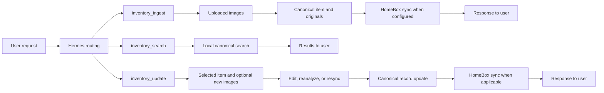

# Hermes Inventory Flows

This guide maps command flow, setup flow, and the main backend flows for operators and users. It describes current behavior only.

## Setup Flow

Choose the installation path that matches the Hermes deployment. Both paths end with the same Inventory setup checks.

```mermaid
flowchart LR
    Start([Start]) --> Platform{Hermes platform}
    Platform --> Windows[Windows Hermes Desktop]
    Platform --> Container[Container or server]

    Windows --> W1[Clone or pull plugin in Hermes plugins folder]
    W1 --> W2[Restart Hermes if open]
    W2 --> W3[Enable hermes-inventory in the GUI]
    W3 --> W4[Restart Hermes again]
    W4 --> W5[Confirm Inventory tools are visible]

    Container --> C1[Place or update plugin in mounted plugins directory]
    C1 --> C2[Restart container or Hermes service]
    C2 --> C3[Confirm plugin loads and tools are visible]
    C3 --> C4[Run setup secrets if environment is not already configured]

    W5 --> Status[/inventory status]
    C4 --> Status
    Status --> Setup[/inventory setup]
    Setup --> Storage[/inventory setup storage]
    Storage --> HomeBox[/inventory setup homebox]
    HomeBox --> Secrets[/inventory setup secrets]
    Secrets --> Test[/inventory homebox test]
    Test --> Ready([Ready for ingest, search, and update])
```

- **Windows:** use Hermes Desktop to open the actual plugin folder, then clone or pull `hermes-inventory`. Enable the plugin after the first restart and restart again before starting a new chat.
- **Container or server:** update the plugin checkout in the mounted plugins directory, then restart or redeploy the Hermes service. Configure secrets through the container environment when that is the deployment standard.
- **Setup:** `/inventory setup` reports the resolved paths and connection state. Use the storage, HomeBox, and secrets commands only as needed for the deployment.

## Slash Command Overview

Slash commands support setup, health checks, and local reconciliation. Reconciliation previews are read-only unless `--resolve` is present.

```mermaid
flowchart TD
    Admin[Operator or admin action] --> Root[/inventory]
    Root --> Status[/inventory status]
    Root --> Setup[/inventory setup]
    Root --> HomeBox[/inventory homebox test]
    Root --> Refresh[/inventory refresh]

    Setup --> Storage[/inventory setup storage]
    Setup --> SetupHomeBox[/inventory setup homebox]
    Setup --> Secrets[/inventory setup secrets]

    Status --> Health[Path, configuration, and local-state report]
    Storage --> StorageResult[Validated storage configuration]
    SetupHomeBox --> URLResult[HomeBox URL configuration]
    Secrets --> SecretResult[Secure local or environment secret workflow]
    HomeBox --> HomeBoxResult[Non-destructive connection result]

    Refresh --> Preview[Read-only reconciliation preview]
    Refresh --> Verbose[/inventory refresh --verbose]
    Refresh --> Resolve[/inventory refresh --resolve]
    Refresh --> ResolveDry[/inventory refresh --resolve --dry-run]
    Refresh --> ResolveChoice[/inventory refresh --resolve number inventory-id]

    Verbose --> Detail[Detailed reconciliation evidence]
    Resolve --> Deterministic[Backup then deterministic local actions]
    ResolveDry --> ResolvePreview[Read-only resolution preview]
    ResolveChoice --> Explicit[Backup then one revalidated selected migration]
```

- `/inventory` and `/inventory status` provide entry-point and health information.
- `/inventory setup`, `/inventory setup storage`, `/inventory setup homebox`, and `/inventory setup secrets` configure local storage and HomeBox access.
- `/inventory homebox test` verifies the configured connection without changing HomeBox.
- `/inventory refresh` previews reconciliation. `--verbose` adds diagnostic detail.
- `/inventory refresh --resolve` applies only deterministic local actions after a verified backup.
- `/inventory refresh --resolve --dry-run` previews that resolution path.
- `/inventory refresh --resolve <#> <inventory-id>` applies a human-selected displayed retry candidate after fresh validation.

## Main User-Facing Tool Flows

Hermes routes clear physical-inventory requests to one of three tools. Canonical local records remain the durable local system of record.



- **Ingest:** photographs become a canonical local record before any HomeBox synchronization.
- **Search:** queries read local canonical data and do not modify records.
- **Update:** edits, reanalysis, and resync target a selected existing item. HomeBox synchronization occurs only when the requested operation needs it.

## Refresh and Reconciliation

Refresh compares canonical records, historical evidence, reservations, transactions, and HomeBox data. Preview commands never write data.

```mermaid
flowchart TD
    Start[/inventory refresh] --> Options{Options}
    Options --> Preview[Preview]
    Options --> Verbose[Verbose preview]
    Options --> Resolve[Resolve]

    Preview --> Scan[Read canonical, legacy, and HomeBox state]
    Verbose --> Scan
    Scan --> Report[Read-only report]

    Resolve --> Choice{Explicit number and inventory ID supplied?}
    Choice -->|No| Plan[Build deterministic local plan]
    Choice -->|Yes| Validate[Revalidate displayed candidate, source hashes, and HomeBox identity]
    Plan --> Backup[Create and verify backup]
    Validate --> Backup
    Backup --> Apply[Apply permitted local changes]
    Apply --> Final[Final refresh report]

    Report --> NoWrite[No changes]
    Choice -->|Dry run| ResolvePreview[Read-only resolution preview]
```

- `/inventory refresh` and `/inventory refresh --verbose` are read-only.
- `--resolve` creates and verifies a backup before permitted local changes.
- Explicit retry resolution requires a displayed ambiguity number and candidate ID. It revalidates evidence immediately before mutation.
- Refresh does not modify existing HomeBox items or delete legacy evidence.
